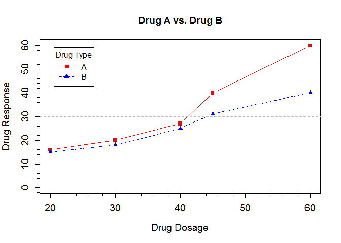
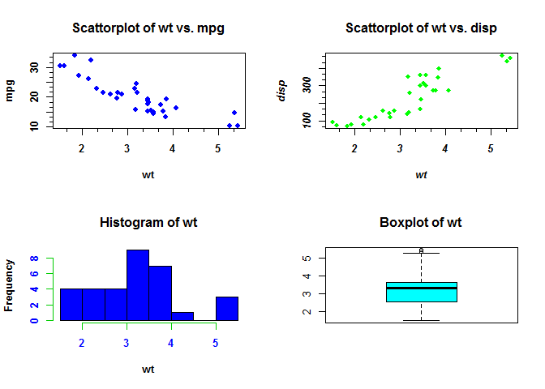
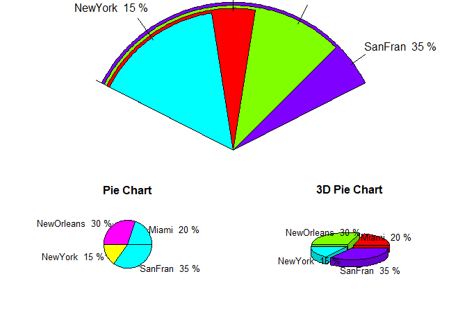
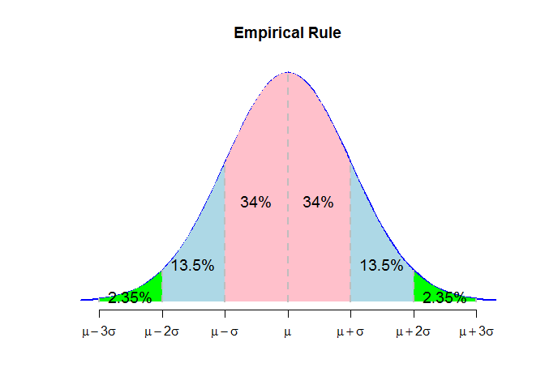
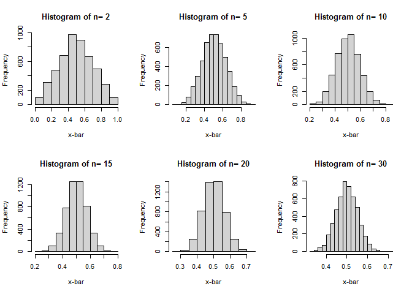
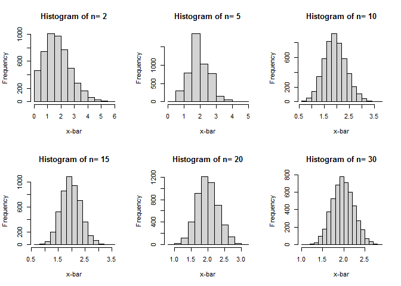
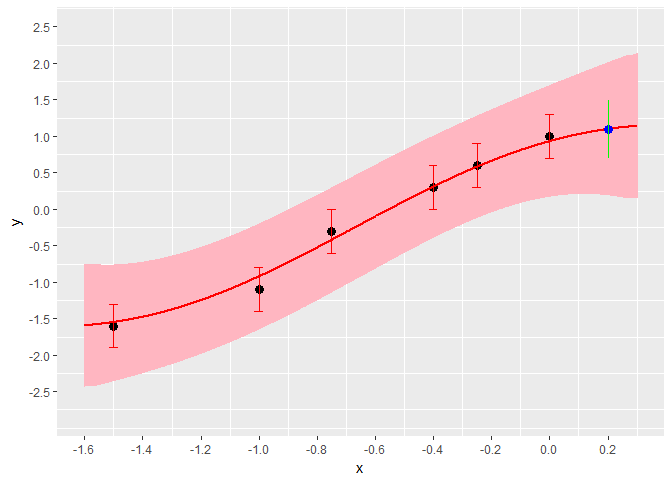

Graphs used in STAT 243
================
Author: Ma
August 8, 2017

This is to summarize all graphs used in STAT 243 at PSU.

Here is the first figure, which shows us how to plot line and add legends:

``` r
dose <- c(20, 30, 40, 45, 60)
drugA <- c(16, 20, 27, 40, 60)
drugB <- c(15, 18, 25, 31, 40)
plot(x=dose,y=drugA,type="b",lty=1,pch=15,col="red",ylim=c(0,60),
     ylab="Drug Response",xlab="Drug Dosage",cex.lab=1.2,cex.axis=1.2)
lines(dose,drugB,type="b",lty=2,pch=17,col="blue")
abline(h=c(30),lwd=1.5,lty=2,col="gray")
title(main="Drug A vs. Drug B",cex=1.5)
legend("topleft",title="Drug Type",c("A","B"),col=c("red","blue"),
       lty=1:2,pch=c(15,17),inset=0.05)
library(Hmisc)
minor.tick(nx=5, ny=5, tick.ratio=0.5)
```



The second practice:

``` r
x<-seq(from=20,to=50,by=0.1)
f11<-function(z) 108+0.2*z
f12<-function(z) 132+0.2*z
f21<-function(z) 101+2.15*z
f22<-function(z) 119+8.15*z
plot(x,f11(x),type="n",ylim=c(100,max(f11(x),f12(x),f21(x),f22(x))),
     main ="Line Graph for Model1 and Model2",ylab="y",cex.main=1.2,
     cex.lab=1.2,cex.axis=1.1)
lines(x,f11(x),lty=2,cex=0.5,col="red")
lines(x,f12(x),lty=2,cex=0.5,col="black")
lines(x,f22(x),lty=1,cex=0.5,col="green")
lines(x,f21(x),lty=1,cex=0.5,col="blue")
legend(x=20,y=510,c("Model1","Model2"),lty=2:1,cex=1.2)
text(x=40,y=105,labels="y=108+0.2x",col="red")
text(x=43,y=155,labels="y=132+0.2x",col="black")
text(x=45,y=212,labels="y=101+2.15x",col="blue")
text(x=45,y=455,labels="y=119+8.15x",col="green")
minor.tick(nx=5, ny=5, tick.ratio=0.5)
```


The third plot:

``` r
attach(mtcars)
par(mfrow=c(2,2))
plot(wt,mpg,main="Scattorplot of wt vs. mpg",col="blue",pch=16,font=2,font.lab=2)
minor.tick(nx=3,ny=3,tick.ratio=0.5)
plot(wt,disp,main="Scattorplot of wt vs. disp",col="green",pch=18,font=4,font.lab=4)
minor.tick(nx=3,ny=3,tick.ratio=0.5)
hist(wt,font=2,font.lab=2,col=12,col.axis=20,fg=19)
boxplot(wt,main="Boxplot of wt",col=21)
```



Histogram:

``` r
A<-matrix(c(29,13,7,7,7,21),nc=2,byrow = T)
colnames(A)<-c("Placebo","Treated")
rownames(A)<-c("None","Some","Marked")
par(mfrow=c(1,2))
barplot(A,width=0.5,col=c(3,4,5),legend.text = TRUE,space=NULL,
        ylab="frequency",main="stacked bar plot")
barplot(A,width=0.2,col=c(3,4,5),legend.text = TRUE,space=NULL,
        ylab="frequency",beside=TRUE,main="grouped bar plot")
```


Pie Charts:

``` r
mat<-matrix(c(1,1,2,3), nrow=2, ncol=2, byrow = TRUE)# three plots, first plot located in (1,1) and (1,2)
layout(mat) #rearrange layout. 
Mi<-rep("Miami",16) 
NO<-rep("NewOrleans",24) 
NY<-rep("NewYork",12) 
SF<-rep("SanFran",28) 
counts<-c(16,24,12,28)
lbs<-c("Miami","NewOrleans","NewYork","SanFran")
lbs2<-paste(lbs,"",round(counts/sum(counts)*100),"%")

#install.packages("plotrix")
library(plotrix)
fan.plot(counts,labels=lbs2,main="Fan Plot",ticks=TRUE)
pie(counts,lbs2,col=13:15,main="Pie Chart",font.main=2)
#pie3D(counts,labels=lbs2,labelcex=0.8,main="3D Pie Chart")#explode: detach
pie3D(counts,labels=lbs2,labelcex=0.8,explode=0.1,main="3D Pie Chart",font.main=2)#explode
```



A fancy Histogram:

``` r
attach(mtcars)
hist(mpg,xlim=c(5,40),probability = TRUE,density=10,col=3,xlab="Miles Per Gallon",
     main="Histogram of Miles Per Gallon")
lines(density(mpg),col=12,lwd=2)
d=density(mpg)
#rug(jitter(mtcars$mpg))
polygon(c(min(d$x), d$x, max(d$x)), c(0, d$y, 0),
        col = "lightgreen", border = NA)
brk<-seq(10,35,5)
ht=NULL
for (i in brk) ht = c(ht, d$y[which.min(abs(d$x - i))])
segments(brk,0,brk,ht,lty=3)
```


Empirical Rule:

``` r
x<-seq(-3.3,3.3,0.1)
plot(x,dnorm(x),lwd=2,type="l",lty=1,ylab="Density",col="blue",ann=FALSE,axes=FALSE)
i=-3
while(i<=3){
  polygon(c(i,seq(i,i+1,0.01),i+1),c(0,dnorm(seq(i,i+1,0.01)),0),
          col=c("green","lightblue","pink","pink","lightblue","green")[i+4],border=FALSE)
  i<-i+1
} 
brk<-seq(-3,3,1)
segments(brk,0,brk,dnorm(brk),col="gray",lwd=2,lty=2)
for(i in 0.5:2.5){
  text(c(-i,i),dnorm(c(-i,i))/2,labels=rep(c("34%","13.5%","2.35%")[i+0.5],2),cex=1.2)
}
title("Empirical Rule")
axis(side=1,at=seq(-3,3,1),labels=c(expression(mu-paste("3",sigma)),expression(mu-paste("2",sigma)),
expression(mu-sigma),expression(mu),expression(mu+sigma),expression(mu+paste("2",sigma)),expression(mu+paste("3",sigma))))
```



BoxPlot:

``` r
par(mfrow=c(1,2))
boxplot(mpg ~ cyl, data=mtcars,main="Car Mileage Data",xlab="Number of Cylinders",
        ylab="Miles Per Gallon",col=2:4)
boxplot(mpg ~ cyl, data=mtcars,main="Car Mileage Data",xlab="Number of Cylinders",
        ylab="Miles Per Gallon",col=2:4,varwidth=TRUE,notch=TRUE)
```


Demo of normal standardization

``` r
X<-rnorm(10000,12,3) #sample X from normal distribution with mean 12 and S.D. 3
#hist(X,col="grey",breaks=100) #histogram of X
Z<-(X-12)/3 #standardization
#hist(Z,xlim=c(-4,4),col="darkred",breaks=100) #histogram of Z

#plot X and Z in the same graph
XZ<-data.frame(X,Z)
library(reshape2)
XZ1<-melt(XZ) #rearrange data
#library(ggplot2)
qplot(x=value,data=XZ1,shape=variable,colour=variable,geom="histogram",bins=100) #plot X and Z
```


Demo of Central Limit Theorem

Sample from Uniform Distribution:

``` r
N<-5000
n<-c(2,5,10,15,20,30)
par(mfrow=c(2,3))
A<-sapply(n,FUN=function(x){
  lops<-rep(x,N)
  A<-t(sapply(lops,runif))#sample from uniform
  hist(rowMeans(A),main=paste("Histogram of n=",x),xlab="x-bar",col="lightgray")
})  
```



Sample from Poisson with lambda=2 Distribution:

``` r
N<-5000
n<-c(2,5,10,15,20,30)
par(mfrow=c(2,3))
A<-sapply(n,FUN=function(x){
  lops<-rep(x,N)
  A<-t(sapply(lops,rpois,lambda=2))#sample from poisson with lambda=2
  hist(rowMeans(A),main=paste("Histogram of n=",x),xlab="x-bar",col="lightgray")
})
```



Sample from poisson with lambda=.2

``` r
N<-5000
n<-c(2,10,20,30,50,100)
par(mfrow=c(2,3))
A<-sapply(n,FUN=function(x){
  lops<-rep(x,N)
  A<-t(sapply(lops,rpois,lambda=.2))#sample from poisson with lambda=.2
  hist(rowMeans(A),main=paste("Histogram of n=",x),xlab="x-bar",col="lightgray")
})
```


Gaussain Process:

``` r
#gaussian process
library(MASS)
library(ggplot2)
library(reshape2)
Msigma<-function(x1,x2){# return covariance matrix
  sigma<-matrix(NA,nc=length(x2),nr=length(x1))
  for(i in 1:length(x1)){
    sigma[i,]<-sapply(x2,FUN=function(x) {
      exp(-0.5*(x-x1[i])^2)
    }
    )}
  return(sigma)
}
f <- data.frame(x=c(-4,-3,-1,0,2),
                y=c(-2,0,1,2,-1))
x <- f$x
K.xx<-Msigma(x,x)
x.star<-seq(-5,5,0.1)#key to perform GP
K.Star<-Msigma(x,x.star)
K.SStar<-Msigma(x.star,x.star)

sigma.n<-0#noise-free
f.mu<-t(K.Star)%*%solve(K.xx+sigma.n^2*diag(1, ncol(K.xx)))%*%f$y #mean
# L<-chol(K)
# arf<-solve(t(L))%*%solve(L)%*%f$y
# f.mu<-t(K.Star)%*%arf
f.sigma<-K.SStar-t(K.Star)%*%solve(K.xx+sigma.n^2*diag(1, ncol(K.xx)))%*%K.Star#-covariance
# v<-solve(L)%*%K.Star
# f.sigma<-K.SStar-t(v)%*%v

n.samples<-25
values<-matrix(0,nc=n.samples,nr=length(x.star))
for(i in 1:n.samples){
  values[,i]<-mvrnorm(1,f.mu,f.sigma)
}
values1<-cbind(x=x.star,as.data.frame(values))
values2<-melt(values1,id="x")
#########ggplot
#qplot(x=x,y=value,data=values2,group=variable,geom="line")
p<-ggplot(values2,mapping=aes(x=x,y=value))
p+geom_line(aes(group=variable))+
  #geom_line(data=values2,aes(x=x.star,y=f.mu,group=variable),colour="red", size=1)+
  geom_point(data=f,aes(x=x,y=y),colour="red",size=7)+
  geom_errorbar(data=f,aes(x=x,y=NULL,ymin=y-2*sigma.n, ymax=y+2*sigma.n), colour="darkred",width=0.2)+ 
  theme_bw()+
  ggtitle("Gaussian Process")+
  ylab("output, f(x)") +
  xlab("input, x")
```


Gaussain Process 2:

``` r
#training data
x<-c(-1.5,-1,-0.75,-.4,-.25,0)
y<-c(-1.6,-1.1,-.3,.3,.6,1)
values<-data.frame(x,y)
 
###kernel function
sigma.n<-0.3
l<-1
sigma.f<-sqrt(1.61)
Msigma<-function(x1,x2){# return covariance matrix
  sigma<-matrix(NA,nc=length(x2),nr=length(x1))
  for(i in 1:length(x1)){
    sigma[i,]<-sapply(x2,FUN=function(x) {
      sigma.f^2*exp(-0.5*(x-x1[i])^2/l^2)
    }
    )}
  diag(sigma)<-diag(sigma)+sigma.n^2
  return(sigma)
}


########predict for one thousand new point
x.star<-seq(-1.7,0.3,0.001)
x.star<-setdiff(x.star,x)#delet x from x.star
K<-Msigma(x,x) 
K.star<-Msigma(x.star,x)
K.stst<-Msigma(x.star,x.star)
y.star<-K.star%*%solve(K)%*%y
var.y.star<-diag(K.stst-K.star%*%solve(K)%*%t(K.star))


############graph
library(ggplot2) 
p<-ggplot(values,mapping=aes(x=x,y=y))
p+geom_errorbar(data=data.frame(x=x.star,y=y.star),aes(x=x,y=y,ymin=y.star-1.96*sqrt(var.y.star), ymax=y.star+1.96*sqrt(var.y.star)), colour="lightpink",width=.03)+
  geom_point(colour="black",size=3)+
  geom_errorbar(data=values,aes(x=x,y=NULL,ymin=y-.3, ymax=y+.3), colour="red",width=.03)+
  geom_line(data=data.frame(x=x.star,y=y.star),aes(x=x,y=y),colour="red",size=1)+
  geom_point(data=NULL,aes(x=0.2,y=y.star[1901]),colour="blue",size=3)+###########??????????
  geom_errorbar(data=NULL,aes(x=.2,y=NULL,ymin=y.star[1901]-.4, ymax=y.star[1901]+.4), colour="green",width=0)+
  scale_x_continuous(limits=c(-1.6,.3),breaks=seq(-1.6,0.2,.2))+#specify x range
  scale_y_continuous(limits=c(-2.85,2.5),breaks=seq(-2.5,2.5,.5))+
  theme_set(theme_bw())+#white background
  theme(panel.grid.major=element_line(colour=NA))#delete grid
```


